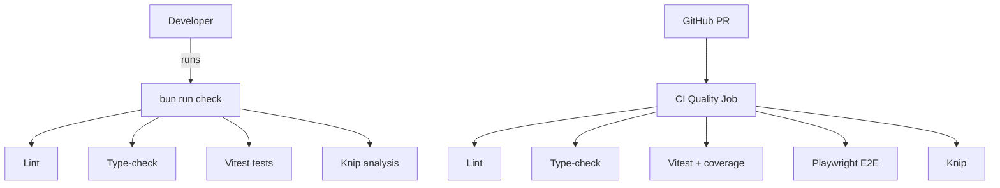

### Goals

- **Add Knip** for unused code/dependency detection and wire it into local and CI workflows.
- **Migrate from Yarn 4 to Bun** for all package management and script execution (local + GitHub Actions).
- **Layer in a few targeted SDLC improvements** that complement your existing Next/Vitest/Playwright setup (excluding any observability vendors like Sentry or Datadog).

### 1. Introduce Knip for unused code & deps

- **Add dependency**
  - In `[package.json](package.json)`, add `knip` as a `devDependency`.
- **Create Knip config**
  - Add a `knip.json` (or `.knip.jsonc`) at the repo root tuned for a Next + Vitest + Playwright + codegen stack (based on your scripts in `package.json`).
  - Configure:
    - **Entry files**: Next app entry points (e.g. `src/app/**/page.tsx`, `src/pages/**/`*, `src/components/**/`*).
    - **Test tooling**: Vitest + Testing Library (so test-only files aren’t marked unused).
    - **Playwright**: mark `playwright.config.`* and `tests/e2e` (or your e2e folder) as known test entries.
    - **Codegen**: include `codegen.ts`, generated GraphQL artifacts, and any `src/graphql` folders as roots so generated types/clients aren’t flagged.
    - Add ignores for config-only files (e.g. `tailwind.config.js`, `postcss.config.cjs`, `.eslintrc`*, Playwright config) that aren’t imported but are required by tools.
- **Add scripts**
  - In `package.json` scripts:
    - Add `"knip": "bunx knip"`.
    - Add `"knip:strict": "bunx knip --strict"` (or with `--dependencies --exports` depending on how aggressive you want to be).
- **Wire into local workflows**
  - Optionally extend `lint` or add a dedicated `"check"` script that runs `lint`, `type-check`, `test`, and `knip` together using Bun.

### 2. Migrate from Yarn 4 to Bun locally

- **Package manager metadata**
  - In `package.json`:
    - Change `"packageManager": "yarn@4.7.0"` to a Bun entry, e.g. `"packageManager": "bun@1.2.0"` (or your preferred Bun version).
- **Lockfile management**
  - Remove `yarn.lock` from version control once Bun is the source of truth.
  - Run `bun install` locally to generate `bun.lockb` and commit it.
- **Script command migration**
  - In `package.json` scripts, replace Yarn-specific invocations with Bun equivalents:
    - `"build": "yarn generate && next build"` → `"build": "bun run generate && bunx next build"` or keep `next build` bare if you rely on `node_modules/.bin`.
    - `"dev": "concurrently \"next dev -p 3333\" \"yarn generate --watch \"{components,pages}/**/*{.ts,.tsx}\\\"\""` → swap `yarn generate` for `bun run generate`, keeping the `concurrently` pattern.
    - `"format": "npx prettier --write . --ignore-path .gitignore"` → `"format": "bunx prettier --write . --ignore-path .gitignore"`.
    - `"generate": "npx graphql-codegen --config codegen.ts"` → `"generate": "bunx graphql-codegen --config codegen.ts"`.
    - Any other `npx`/`yarn` usages in scripts (`lint:fix`, etc.) → `bun run` or `bunx` equivalents.
  - Keep `next`, `playwright`, `vitest`, etc. as direct CLI calls (Bun runs them via `node_modules/.bin`), or prefix with `bunx` if you prefer explicitness.
- **Engines & runtime**
  - Keep the existing `"engines": { "node": ">=24" }` if you still rely on Node for some environments, but validate that Bun runs everything cleanly (GraphQL codegen, Next build, Playwright).

### 3. Update GitHub Actions to use Bun

- **Identify existing workflows**
  - Inspect `.github/workflows/*.yml` to see how Yarn 4 is currently used for install/build/test.
- **Add Bun setup step**
  - In each workflow running JS tasks (build, tests, lint, e2e):
    - Add `oven-sh/setup-bun` action to install your chosen Bun version.
- **Switch install and scripts to Bun**
  - Replace `yarn install`/`yarn install --immutable` with `bun install`.
  - Replace `yarn build`, `yarn test`, etc. with the corresponding `bun run` targets (`bun run build`, `bun run test`, `bun run lint`, `bun run knip`).
- **Add a dedicated "quality gate" job**
  - Create or update a job (e.g. `quality`) that runs sequentially or in parallel:
    - `bun run lint`
    - `bun run type-check`
    - `bun run test` (Vitest)
    - `bun run test:e2e` (Playwright, possibly in a separate matrix job)
    - `bun run knip` (optionally strict only on main-branch or PRs to main).

### 4. Extra SDLC goodies (non-observability)

- **Consolidated `check` script**
  - Add a single `"check"` script in `package.json`:
    - Example: `"check": "bun run lint && bun run type-check && bun run test && bun run knip"`.
  - Use this both locally and in CI to keep parity between developer and pipeline checks.
- **Vitest coverage & thresholds**
  - Enable coverage in Vitest configuration (if not already):
    - Add a `"test:coverage"` script, e.g. `"test:coverage": "vitest run --coverage"`.
    - Configure coverage thresholds (global or per-file) in `vitest.config.`* to prevent regressions.
  - Add a CI step that runs `bun run test:coverage` on PRs, at least for the main branch.
- **Pre-commit enforcement tightening**
  - Extend existing `lint-staged` + `husky` hooks so that on pre-commit you run:
    - `lint-staged` for TS/TSX formatting + lint.
    - Optionally a lightweight `bun run knip` variant (or only on CI, if performance is a concern locally).
- **Dependency health/audit**
  - Add a `"deps:audit"` script that uses `bunx` to run `npm audit` or a similar OSS advisory check.
  - Optionally schedule a weekly GitHub Actions workflow that runs `deps:audit` and posts results as a job summary.
- **Playwright report artifacts in CI**
  - Ensure Playwright runs in CI upload its HTML report as an artifact so failures are easier to debug (if not already configured in your workflows).

### 5. Rollout & verification

- **Local smoke test**
  - After Bun migration, run locally:
    - `bun install`
    - `bun run dev`
    - `bun run build`
    - `bun run test`, `bun run test:e2e`, `bun run knip`.
- **CI validation**
  - Push a branch and confirm GitHub Actions jobs succeed with Bun.
  - Tune Knip config to avoid false positives (e.g. dynamic imports, Next app router conventions) by iterating on the ignore patterns.

### (Optional) Mermaid overview of checks

